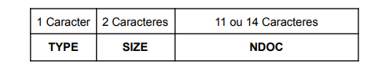
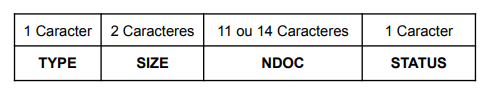
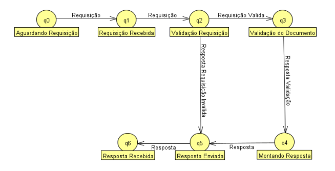

# Especificação do Protocolo CACC - CPF and CNPJ Checker

O Protocolo CACC (CPF and CNPJ Checker) opera na camada de aplicação e tem como objetivo validar números de CPF (Cadastro de Pessoas Físicas) e CNPJ (Cadastro Nacional da Pessoa Jurídica). Utiliza o protocolo TCP na camada de transporte e escuta na porta 80. Este protocolo utiliza codificação de caracteres ASCII.

## Formato da Requisição

As requisições são enviadas pelo cliente ao servidor no formato de uma string, contendo três campos separados por ponto e vírgula:

- **TYPE**: Indica o tipo de documento a ser validado, onde 1 representa CPF e 2 representa CNPJ.
- **SIZE**: Especifica o tamanho do número do documento enviado sendo esperado 11 para cpf ou 14 para cnpj.
- **NDOC**: Contém o número do documento (CPF ou CNPJ) a ser validado.

Exemplo de requisição CPF: `1;11;11111111111`
Exemplo de requisição CNPJ: `2;14;11111111111111`

## Formato da Resposta

As respostas do servidor ao cliente seguem um formato semelhante, contendo quatro campos separados por ponto e vírgula:

- **TYPE**: Indica o tipo de arquivo enviado, onde 1 representa CPF e 2 representa CNPJ.
- **SIZE**: Indica o tamanho do documento recebido, sendo 11 para cpf e 14 para cnpj.
- **NDOC**: Contém o número do documento (CPF ou CNPJ) que foi validado.
- **STATUS**: Representa o código de status da resposta, onde:
  - 1: Indica que o documento é válido.
  - 2: Indica que o documento é inválido.
  - 3: Indica um tamanho de documento inválido.
  - 4: Tipo não suportado.
  - 5: Indica um erro na requisição.
  - 6: Indica um erro nos valores recebidos nos campos da requisição.

Exemplos de respostas:
- CPF válido: `1;11;11111111111;1`
- CNPJ inválido: `2;14;11111111111111;2`
- Resposta Padrão de Tamanho de Documento Inválido: `TYPE;SIZE;NDOC;3`
- Resposta Padrão de Tipo de Documento Inválido: `TYPE;SIZE;NDOC;4`
- Resposta Padrão de Erro na Requisição: `0;0;0;5`
- Resposta Padrão de Erro nos Valores Recebidos nos Campos da Requisição: `0;0;0;6`

  

## Fluxo de Comunicação

1. **Aguardando requisição**: O servidor aguarda uma requisição do cliente.
2. **Requisição recebida**: O servidor recebe a requisição.
3. **Validação da requisição**: O servidor valida se a requisição é válida.

### Fluxo requisição válida:

4. **Validação do documento**: O servidor inicia o processo de validação do documento.
5. **Montando resposta**: O servidor monta a resposta a ser enviada para o cliente.
6. **Resposta enviada**: O servidor manda a resposta para o cliente.
7. **Resposta recebida**: O cliente recebe a resposta do servidor.

### Fluxo requisição inválida:

4. **Resposta enviada**: O servidor manda uma das duas respostas padrão de erro para o cliente.
5. **Resposta recebida**: O cliente recebe a resposta do servidor.

## Diagrama de Estados Finitos

## Licença

Este projeto está licenciado sob a Licença MIT.

